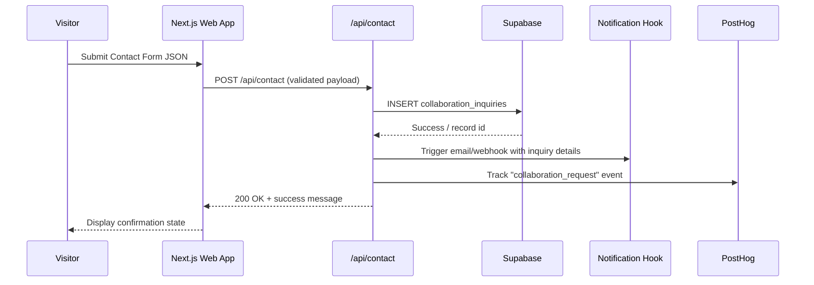

# Project Web NMD Architecture Document

## Introduction
This document outlines the overall project architecture for Project Web NMD, including backend systems, shared services, and non-UI specific concerns. Its primary goal is to serve as the guiding architectural blueprint for AI-driven development, ensuring consistency and adherence to chosen patterns and technologies.

**Relationship to Frontend Architecture:**
If the project includes a significant user interface, a separate Frontend Architecture Document will detail the frontend-specific design and MUST be used in conjunction with this document. Core technology stack choices documented herein (see "Tech Stack") are definitive for the entire project, including any frontend components.

### Starter Template or Existing Project
Adopting a customized Next.js 16 + Turborepo scaffold (via `create-next-app` inside a monorepo) as the foundation. This gives us App Router defaults, shared package support (`packages/ui`, `packages/animation`), and smooth integration with Shadcn UI, Tailwind, Codex CI/CD, and Vercel deploy scripts while leaving room for GSAP/Three.js tooling from Epic 1.

### Change Log

| Date | Version | Description | Author |
|------|---------|-------------|--------|
| 2024-06-04 | v0.1 | Initial architecture draft kickoff | Winston |

## High Level Architecture

### Technical Summary
Project Web NMD is a monorepo-hosted, server-rendered web experience built on Next.js 16 (App Router) with TypeScript, Shadcn UI, and Tailwind providing composable UI primitives. GSAP and Three.js handle motion/3D layers, while Vercel Functions cover light backend needs (contact form, analytics webhooks) and Supabase stores collaboration submissions. Assets (images, GLB logo, audio snippets) live in Vercel Blob/S3-compatible storage fronted by a CDN. Codex CI/CD plus Vercel deployments ensure every merge runs lint/tests, generates static assets, and promotes to preview/production with observability via Vercel Analytics and optional PostHog instrumentation.

### High Level Overview
1. **Architectural Style:** Modular monolith (Next.js app with serverless endpoints) optimized for immersive frontends; no separate backend services required initially.  
2. **Repo Structure:** Monorepo using Turborepo/PNPM workspaces housing `apps/web`, shared component packages, and infrastructure scripts.  
3. **Service Architecture:** Frontend-focused Next.js server handling SSR/ISR, API routes for form submissions + telemetry, and integrations with external services (Spotify deep links, Supabase).  
4. **Primary Flow:** User hits Vercel edge → Next.js streams loader/hero UI → GSAP/Three orchestrate client-side motion → audio previews served via CDN → contact submissions POST to Vercel Function → stored in Supabase and notified via webhook/email.  
5. **Key Decisions:** Use App Router/RSC for performance, centralize motion helpers in shared package, rely on Vercel platform for hosting + analytics, keep data footprint light (Supabase for form data) while instrumenting custom events in PostHog for KPI tracking.

### High Level Project Diagram
```mermaid
graph TD
    User((Visitor)) -->|HTTPS| Edge[Vercel Edge Network]
    Edge --> NextApp[Next.js 16 App (SSR/ISR)]
    NextApp --> UI[Shadcn/Tailwind UI Layer]
    UI --> Anim[GSAP + Three.js Engine]
    NextApp --> API[Vercel Functions (contact, telemetry)]
    API --> Supabase[(Supabase DB + Storage)]
    Supabase --> Notify[Email/Webhook Notifications]
    UI --> CDN[Asset CDN (images, GLB, audio snippets)]
    UI --> Spotify[Spotify Deep Links]
    NextApp --> Analytics[Vercel Analytics & PostHog]
```

## Tech Stack

### Cloud Infrastructure
- **Provider:** Vercel (Edge + Functions + Blob Storage)
- **Key Services:** Edge Network/Edge Config, Next.js SSR/ISR hosting, Vercel Functions for contact form + webhooks, Vercel Blob for static/GLB/audio assets, integrated analytics dashboards
- **Deployment Regions:** Auto-distributed edge, primary build region `iad1` (US East) with global CDN replication

### Technology Stack Table
| Category | Technology | Version | Purpose | Rationale |
| --- | --- | --- | --- | --- |
| Language | TypeScript | 5.4.x | Strongly typed application code across Next.js + functions | Aligns with React ecosystem, improves reliability for AI agents |
| Runtime | Node.js | 20 LTS | Server runtime for Next.js + Vercel Functions | Latest LTS with stable Fetch API, good perf for SSR |
| Framework | Next.js | 16.x (App Router) | Primary web framework (SSR/ISR, RSC) | Matches PRD, excellent for cinematic UX + streaming |
| UI Library | Shadcn UI | 2024.05 snapshot | Accessible, composable component primitives | Rapid theming with Tailwind, matches UX spec |
| Styling | Tailwind CSS | 3.4.x | Utility-first styling + theming tokens | Fast iteration for bespoke visuals |
| Animation | GSAP / Three.js | GSAP 3.12.x, Three.js 0.164.x | Scroll/motion/3D engine | Meets FR1–FR5 animation requirements |
| State/Data Layer | React Server Components + Zustand (optional) | RSC native, Zustand 4.x | Lightweight shared state for audio/teaser toggles | Avoids heavier global stores |
| Bundler/Build | Turborepo + PNPM | Turborepo 1.12, PNPM 9 | Monorepo orchestration & package management | Speeds shared package builds (`ui`, `animation`) |
| Testing (unit) | Vitest | 1.6.x | Fast unit/utility tests | TS-native, compatible with Next.js |
| Testing (e2e/visual) | Playwright | 1.43.x | End-to-end + visual regression (GSAP flows) | Handles motion, multi-browser coverage |
| Backend/API | Vercel Functions | Node 20 | Contact form + analytics ingestion | Zero-maintenance serverless |
| Database | Supabase (Postgres) | 15.x | Store collaboration inquiries + optional metadata | Simple serverless Postgres with RLS & dashboards |
| Storage/CDN | Vercel Blob (S3-compatible) | Managed | Host portraits, GLB logo, audio snippets | Integrated CDN + signed URLs |
| Analytics | Vercel Analytics + PostHog | Native + 1.80.x | Core Web Vitals + KPI event tracking | Combines platform metrics with custom events |
| CI/CD | Codex CI/CD on Vercel | Managed | Lint/test/build/deploy pipeline | Matches PRD, simple approvals/rollbacks |
| Monitoring/Logging | Vercel observability + Logflare (optional) | Managed | Edge/function logs | Centralized access via Vercel dashboard |

## Data Models

### CollaborationInquiry
**Purpose:** Persist collaboration/booking requests captured from the contact form for follow-up and KPI tracking.

**Key Attributes:**
- `id`: UUID – Primary key for each inquiry
- `submitted_at`: timestamptz – UTC timestamp of submission
- `name`: text – Requestor’s full name
- `organization`: text – Company/collective (optional)
- `email`: citext – Contact email, unique per inquiry
- `inquiry_type`: text – Enum (`collaboration`, `booking`, `press`, `other`)
- `message`: text – Free-form description of request
- `target_artist`: text – Optional artist/member referenced
- `source_path`: text – Page/section where CTA triggered
- `consent_newsletter`: boolean – Whether user opted into updates

**Relationships:**
- None initially; standalone table but can join to future `notify_opt_ins`.

### NotifyOptIn
**Purpose:** Store “Midnight Is Close” teaser opt-ins for future release announcements.

**Key Attributes:**
- `id`: UUID
- `email`: citext – subscriber email
- `opted_at`: timestamptz – timestamp
- `campaign`: text – e.g., `midnight-is-close`
- `metadata`: jsonb – device, locale, etc.

**Relationships:**
- Can reference `collaboration_inquiries.email` for deduplication but not enforced.

## Components

### Next.js Web Experience
**Responsibility:** Render SSR/ISR pages, hydrate cinematic UI, orchestrate data fetching.  
**Key Interfaces:** HTTP(S) requests, React Server Components, API routes `/api/contact`, `/api/events`.  
**Dependencies:** Shadcn UI, Tailwind, GSAP/Three packages, Vercel Edge network.  
**Technology Stack:** Next.js 16, TypeScript, App Router.

### Animation & Audio Engine
**Responsibility:** Encapsulate GSAP timelines, Three.js scenes, audio preview controller shared across sections.  
**Key Interfaces:** Exposes hooks/components (`useLoaderTimeline`, `<AudioPreview />`).  
**Dependencies:** GSAP, Three.js, Web Audio API, Zustand store.  
**Technology Stack:** Custom package `packages/animation`.

### Asset Pipeline & CDN
**Responsibility:** Store and deliver portraits, GLB logo, audio snippets with caching + signed URLs.  
**Key Interfaces:** Vercel Blob REST, image optimization endpoints.  
**Dependencies:** Build scripts to upload assets, Next.js Image component.  
**Technology Stack:** Vercel Blob storage, Next.js Image optimization.

### Contact & Telemetry API
**Responsibility:** Handle POST submissions, validate inputs, persist to Supabase, emit notifications and analytics events.  
**Key Interfaces:** `/api/contact` (POST JSON), `/api/event` (POST metrics).  
**Dependencies:** Supabase client, email/webhook service (Supabase functions or Resend), PostHog SDK.  
**Technology Stack:** Vercel Functions (Node 20), Supabase JS client.

### Analytics & Monitoring Layer
**Responsibility:** Capture Core Web Vitals, PostHog custom events, log errors, expose dashboards.  
**Key Interfaces:** PostHog ingest API, Vercel Analytics collector, Logflare streaming logs.  
**Dependencies:** Contact/API events, client-side hooks.  
**Technology Stack:** PostHog, Vercel Analytics, Logflare (optional).

### Component Diagram
```mermaid
graph TD
    subgraph Frontend
        WebApp[Next.js Web App]
        AnimPkg[Animation Package]
        AudioCtrl[Audio Preview Controller]
    end
    subgraph Backend
        ContactAPI[Vercel Function /api/contact]
        EventsAPI[/api/event]
        SupabaseDB[(Supabase Postgres)]
    end
    subgraph Infra
        Blob[Vercel Blob/CDN]
        AnalyticsSvc[Vercel Analytics + PostHog]
    end

    WebApp --> AnimPkg
    WebApp --> AudioCtrl
    WebApp --> Blob
    WebApp --> ContactAPI
    WebApp --> EventsAPI
    ContactAPI --> SupabaseDB
    ContactAPI --> AnalyticsSvc
    EventsAPI --> AnalyticsSvc
    AnimPkg --> Blob
```

## External APIs
- No third-party API integrations are required for MVP; Spotify interactions are simple deep links that do not call authenticated endpoints. Should future releases require Spotify Web API (e.g., dynamic tracklists), we will extend this section accordingly.

## Core Workflows


## REST API Spec
```yaml
openapi: 3.0.0
info:
  title: Project Web NMD API
  version: 0.1.0
  description: Minimal endpoints for collaboration inquiries and telemetry.
servers:
  - url: https://project-web-nmd.vercel.app/api
    description: Production
  - url: https://project-web-nmd-preview.vercel.app/api
    description: Preview Deployments
paths:
  /contact:
    post:
      summary: Submit a collaboration inquiry
      requestBody:
        required: true
        content:
          application/json:
            schema:
              $ref: '#/components/schemas/CollaborationInquiryInput'
      responses:
        '200':
          description: Submission accepted
          content:
            application/json:
              schema:
                $ref: '#/components/schemas/ContactResponse'
        '400':
          description: Validation error
        '500':
          description: Unexpected failure
  /event:
    post:
      summary: Record custom analytics event (audio preview, teaser engagement)
      requestBody:
        required: true
        content:
          application/json:
            schema:
              $ref: '#/components/schemas/EventPayload'
      responses:
        '202':
          description: Event queued

components:
  schemas:
    CollaborationInquiryInput:
      type: object
      required: [name, email, inquiryType, message]
      properties:
        name:
          type: string
          maxLength: 120
        organization:
          type: string
          maxLength: 200
        email:
          type: string
          format: email
        inquiryType:
          type: string
          enum: [collaboration, booking, press, other]
        message:
          type: string
          maxLength: 2000
        targetArtist:
          type: string
        sourcePath:
          type: string
        consentNewsletter:
          type: boolean
    ContactResponse:
      type: object
      properties:
        status:
          type: string
          example: success
        inquiryId:
          type: string
          format: uuid
    EventPayload:
      type: object
      required: [event, properties]
      properties:
        event:
          type: string
          example: audio_preview_start
        properties:
          type: object
          additionalProperties: true
```

## Database Schema
```sql
-- Supabase / Postgres schema for collaboration inquiries
create table if not exists collaboration_inquiries (
  id uuid primary key default gen_random_uuid(),
  submitted_at timestamptz not null default now(),
  name text not null,
  organization text,
  email citext not null,
  inquiry_type text not null check (inquiry_type in ('collaboration','booking','press','other')),
  message text not null check (char_length(message) <= 2000),
  target_artist text,
  source_path text,
  consent_newsletter boolean not null default false,
  user_agent text,
  ip_hash text
);

create index if not exists idx_collab_email on collaboration_inquiries (email);

create table if not exists notify_opt_ins (
  id uuid primary key default gen_random_uuid(),
  email citext not null,
  campaign text not null,
  opted_at timestamptz not null default now(),
  metadata jsonb default '{}'::jsonb
);

create unique index if not exists idx_notify_unique on notify_opt_ins (email, campaign);
```

## Source Tree
```plaintext
project-web-nmd/
├── apps/
│   └── web/
│       ├── app/                     # Next.js App Router routes
│       │   ├── (sections)/          # Loader, hero, artists, music, teaser
│       │   ├── api/
│       │   │   ├── contact/route.ts # POST contact handler
│       │   │   └── event/route.ts   # Custom analytics ingest
│       │   └── layout.tsx
│       ├── components/
│       ├── lib/
│       │   ├── analytics/
│       │   ├── validations/
│       │   └── supabase.ts
│       ├── styles/
│       ├── public/                  # Fallback assets (static)
│       └── package.json
├── packages/
│   ├── ui/                          # Shadcn component extensions + tokens
│   ├── animation/                   # GSAP/Three helpers, audio controller
│   └── config/                      # Shared ESLint/TS configs
├── assets/
│   ├── images/
│   ├── audio/
│   └── models/
├── scripts/
│   ├── upload-assets.ts
│   └── generate-sitemaps.ts
├── infra/
│   ├── vercel.json                  # Edge/function config
│   ├── supabase/
│   │   └── migrations.sql
│   └── posthog/
│       └── dashboard-config.json
├── package.json
├── pnpm-workspace.yaml
├── turbo.json
├── tsconfig.base.json
└── README.md
```

## Infrastructure and Deployment

### Infrastructure as Code
- **Tool:** Vercel project config + Supabase SQL migrations
- **Location:** `infra/vercel.json`, `infra/supabase/migrations.sql`
- **Approach:** Declarative project settings (env vars, edge functions) stored in repo; Supabase CLI handles schema migrations per environment.

### Deployment Strategy
- **Strategy:** Trunk-based development with preview deployments for every PR; main merges promote to production after CI pass.
- **CI/CD Platform:** Codex CI/CD orchestrating lint/tests, handing off to Vercel for build/deploy.
- **Pipeline Configuration:** `.codex/pipeline.yaml` + `vercel.json`

### Environments
- **Development:** Local Next.js dev server + Supabase sandbox; used for rapid iteration.  
- **Preview:** Vercel Preview deployments per PR with isolated Supabase schema (branch-based).  
- **Production:** Vercel Production connected to `main`, Supabase prod project with RLS + backups.

### Environment Promotion Flow
```text
feature/* ➜ PR ➜ CI (lint/test) ➜ Vercel Preview
      │
      ▼
Code Review + QA sign-off
      │
      ▼
Merge to main ➜ CI ➜ Vercel Production ➜ Supabase migration apply
```

### Rollback Strategy
- **Primary Method:** Vercel deployment rollback (one-click revert to last good build) + Supabase point-in-time recovery.
- **Trigger Conditions:** Elevated error rates, failed smoke tests, degraded animation performance, or data corruption alerts.
- **Recovery Time Objective:** < 15 minutes for frontend rollback; < 1 hour for Supabase PITR restore.

## Error Handling Strategy

### General Approach
- **Error Model:** Typed `AppError` utilities encapsulating category, status code, and user-facing message.  
- **Exception Hierarchy:** `AppError` base → `ValidationError`, `ExternalServiceError`, `SystemError`.  
- **Error Propagation:** Validate/handle at API boundary; only sanitized messages returned to client, full detail logged with correlation IDs.

### Logging Standards
- **Library:** `next-axiom` (or Vercel built-in logging) + `pino` 9.x for structured logs in functions.  
- **Format:** JSON with ISO timestamps.  
- **Levels:** debug, info, warn, error (default info in prod).  
- **Required Context:**  
  - Correlation ID: UUID per request (header `x-request-id`, fallback generated).  
  - Service Context: `app=project-web-nmd`, `component=contact-api|event-api|ui`.  
  - User Context: hashed IP + user agent segment; never log raw PII.

### External API Errors
- **Retry Policy:** Exponential backoff (max 3 attempts, 250ms base) for optional webhooks; no retry for user-facing submissions to avoid duplicates.  
- **Circuit Breaker:** Not required initially (no heavy external APIs).  
- **Timeout Configuration:** 5s for Supabase writes; 2s for PostHog ingestion.  
- **Error Translation:** Map Supabase/PostHog errors to `ExternalServiceError` with generic user message.

### Business Logic Errors
- **Custom Exceptions:** `ValidationError` for Zod schema failures, `QuotaExceededError` if we later gate submissions.  
- **User-Facing Errors:** JSON `{ status: "error", message: "Please check your details and try again." }`.  
- **Error Codes:** `CONTACT_VALIDATION_FAILED`, `CONTACT_SAVE_FAILED`, `EVENT_LOG_FAILED`.

### Data Consistency
- **Transaction Strategy:** Single INSERT statements (atomic) for simple forms.  
- **Compensation Logic:** If webhook notification fails after DB write, enqueue retry (supabase function).  
- **Idempotency:** Hash (email + message + timestamp bucket) to prevent duplicate submissions on retry.

## Coding Standards

### Core Standards
- **Languages & Runtimes:** TypeScript 5.4, Node.js 20 LTS, React 18.3 (Next.js 16).  
- **Style & Linting:** ESLint (Next.js + Tailwind plugins) + Prettier enforced via Turborepo pipeline.  
- **Test Organization:** `*.test.ts` for unit tests colocated with modules; e2e specs in `tests/e2e`.

### Naming Conventions
| Element | Convention | Example |
| --- | --- | --- |
| Components | PascalCase, descriptive | `ArtistGallery`, `TeaserScene` |
| Hooks | `use` + Verb + Noun | `useLoaderTimeline`, `useAudioPreview` |
| API Routes | Kebab-case folder | `/api/contact`, `/api/event` |

### Critical Rules
- **No console.log in prod**: Use `logger.info/warn/error` helpers tied to Vercel logging.  
- **All external inputs validated**: Use shared Zod schemas before hitting business logic.  
- **Animation timelines centralized**: Define GSAP timelines in `packages/animation`; do not scatter `gsap.to` calls in React components.  
- **Contact submissions require CSRF token**: Include Next.js anti-CSRF middleware when POSTing from form.  
- **Do not bypass PostHog helper**: All custom events must use `trackEvent()` to ensure schema parity.

## Test Strategy and Standards

### Testing Philosophy
- **Approach:** Test-after with emphasis on critical motion logic + APIs; snapshot/visual tests for GSAP sequences.  
- **Coverage Goals:** ≥80% for utilities/API routes, ≥60% for animation helpers (harder to unit test).  
- **Test Pyramid:** 65% unit, 25% integration (Playwright component/route tests), 10% e2e cinematic journeys.

### Unit Tests
- **Framework:** Vitest 1.6  
- **File Convention:** `*.test.ts` adjacent to source (e.g., `useAudioPreview.test.ts`).  
- **Location:** Inside feature folders or `packages/*`.  
- **Mocking Library:** Built-in Vitest mocks + MSW for fetch stubs.  
- **Coverage Requirement:** 80% statements/branches in targeted modules.

### Integration Tests
- **Scope:** Next.js route handlers, Supabase interactions, animation hooks with mocked DOM.  
- **Location:** `tests/integration`.  
- **Test Infrastructure:**  
  - **Supabase:** Supabase CLI local instance via Docker.  
  - **PostHog:** Mock server (MSW).  
  - **Audio Previews:** Stubbed Web Audio API (jest-web-audio-mock).

### End-to-End Tests
- **Framework:** Playwright 1.43  
- **Scope:** Cinematic entry, artist exploration, music previews on mobile + desktop, contact form submission.  
- **Environment:** Vercel Preview deployments seeded with mock assets.  
- **Test Data:** YAML fixtures for artist data; environment toggle for API mocks.

### Test Data Management
- **Strategy:** Use fixture JSON/MDX for artists and YAML for tracklists; PostHog events mocked during tests.  
- **Fixtures:** `tests/fixtures/*`.  
- **Factories:** `tests/factories/inquiryFactory.ts` for generating submissions.  
- **Cleanup:** Supabase test DB truncated after each suite via CLI command.

### Continuous Testing
- **CI Integration:** Codex pipeline stages (lint → unit → integration → e2e smoke on preview).  
- **Performance Tests:** Lighthouse CI on hero + gallery pages per preview.  
- **Security Tests:** `npm audit` + `pnpm dlx depcheck`, optional Snyk scan weekly.

## Security

### Input Validation
- **Validation Library:** Zod 3.x.  
- **Validation Location:** Client-side forms (basic UX) + API routes (authoritative).  
- **Required Rules:** All external inputs validated at API boundary; whitelist approach (explicit schemas); reject payloads exceeding size limits (e.g., message length).

### Authentication & Authorization
- **Auth Method:** Not required for public site; protect admin endpoints via Vercel password-protected routes if added.  
- **Session Management:** N/A currently; if CMS introduced, use Supabase auth with JWT.  
- **Required Patterns:**  
  - All mutating endpoints require CSRF token + honey-pot hidden field.  
  - Block repeated submissions via rate limit (IP + email) per minute.

### Secrets Management
- **Development:** `.env.local` managed via Doppler or Vercel env editor (never committed).  
- **Production:** Vercel encrypted env vars + Supabase secret manager.  
- **Code Requirements:** No secrets hardcoded; access via `process.env`; never log secrets.

### API Security
- **Rate Limiting:** Middleware using `@upstash/ratelimit` (Redis) or Vercel Edge Config to cap contact submissions (e.g., 5/min/IP).  
- **CORS Policy:** Same-origin for site API; allow preview domains.  
- **Security Headers:** `Strict-Transport-Security`, `Content-Security-Policy` (restrict script origins), `Permissions-Policy` (limit sensors).  
- **HTTPS Enforcement:** Vercel-managed TLS; set `forceHttps` in `vercel.json`.

### Data Protection
- **Encryption at Rest:** Supabase (Postgres) default; Vercel Blob uses provider encryption.  
- **Encryption in Transit:** HTTPS everywhere; Supabase connections via TLS.  
- **PII Handling:** Only store necessary contact metadata; auto-delete inquiries older than 12 months unless follow-up ongoing.  
- **Logging Restrictions:** Never log raw email/message; only hashed email for dedupe.

### Dependency Security
- **Scanning Tool:** GitHub Dependabot + `pnpm audit`.  
- **Update Policy:** Patch weekly, minor monthly unless breaking.  
- **Approval Process:** New runtime deps require architect + dev lead review; record in architecture change log.

### Security Testing
- **SAST Tool:** `eslint-plugin-security` + optional Semgrep in CI.  
- **DAST Tool:** OWASP ZAP scan on preview before major launches.  
- **Penetration Testing:** Annual third-party review ahead of major release.

## Checklist Results Report
- **Execution:** Architect checklist (comprehensive mode) completed 2024-06-04.
- **Section 1 Findings:** Architecture maps cleanly to PRD functional/non-functional requirements; however, note that future CMS or Spotify API needs would require extending data/API sections.
- **Section 2 Findings:** Documentation provides sufficient diagrams/component definitions; keep animation package boundaries explicit to prevent GSAP sprawl.
- **Section 3 Findings:** Tech stack decisions are specific and justified; ensure Supabase + Vercel Blob credentials are managed via IaC to avoid drift.
- **Section 4 Findings:** Frontend UX spec covers flows; handoff prompt embedded in this doc for frontend architect/dev.
- **Section 5 Findings:** Error handling/testing/security strategies are defined; revisit rate limiting and data retention policies once production traffic patterns emerge.

## Next Steps
- Align with UX/front-end team to ensure component inventory + animation helpers mirror this architecture.
- Set up Supabase project + migrations from `infra/supabase/migrations.sql`.
- Configure Vercel project (env vars, Blob buckets) and wire Codex CI/CD to enforce lint/tests.
- Build quick prototypes for loader, gallery, teaser to validate GSAP/Three performance budgets.

### Architect Prompt (for Frontend Architecture / Dev Handoff)
```
Use docs/architecture.md and docs/front-end-spec.md for Project Web NMD to elaborate the frontend/component architecture. Focus on:
- Monorepo structure (apps/web + packages/ui + packages/animation)
- How Shadcn/Tailwind tokens map to cinematic UX spec
- GSAP/Three timeline orchestration and reduced-motion fallbacks
- Shared hooks for audio previews + analytics events
Produce a detailed frontend architecture ready for dev agents.
```
