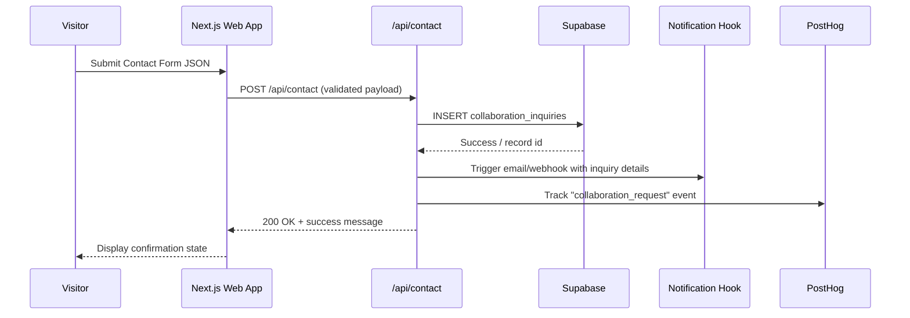

# Core Workflows

```mermaid
sequenceDiagram
    participant U as Visitor
    participant W as Next.js Web App
    participant A as /api/contact
    participant S as Supabase
    participant N as Notification Hook
    participant P as PostHog

    U->>W: Submit Contact Form JSON
    W->>A: POST /api/contact (validated payload)
    A->>S: INSERT collaboration_inquiries
    S-->>A: Success / record id
    A->>N: Trigger email/webhook with inquiry details
    A->>P: Track "collaboration_request" event
    A-->>W: 200 OK + success message
    W-->>U: Display confirmation state
```

