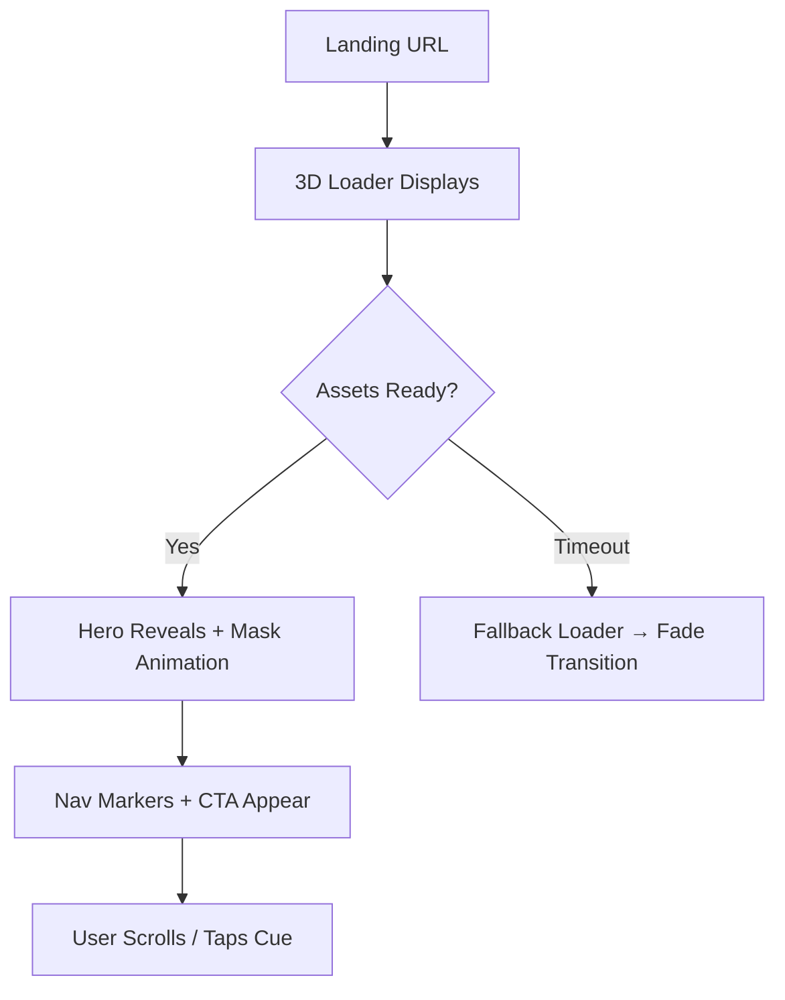
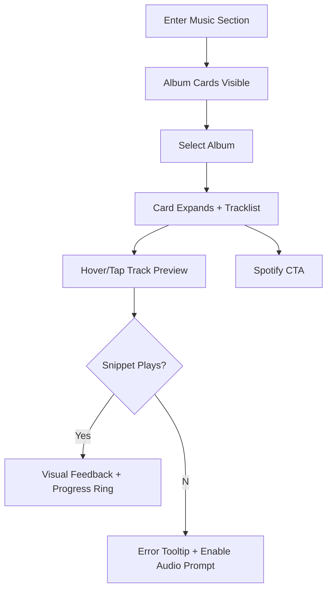
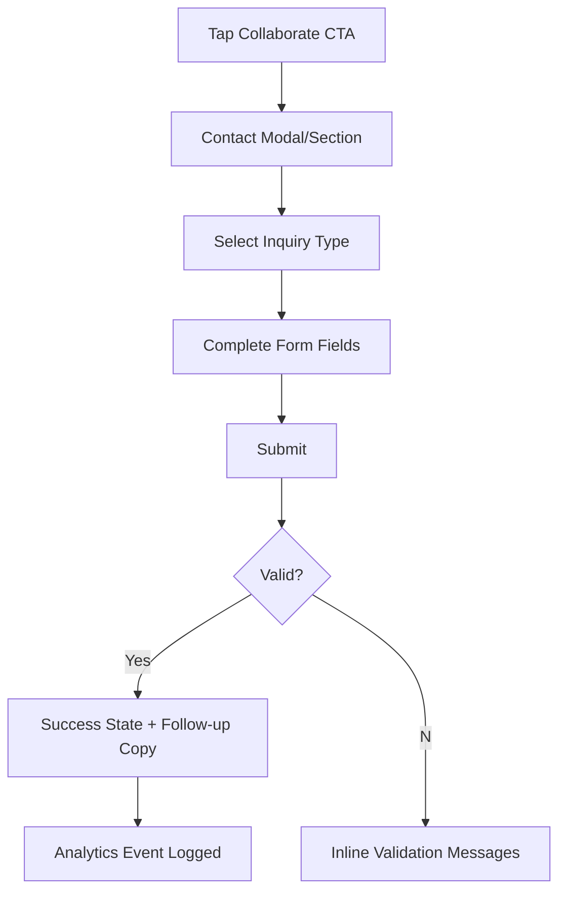
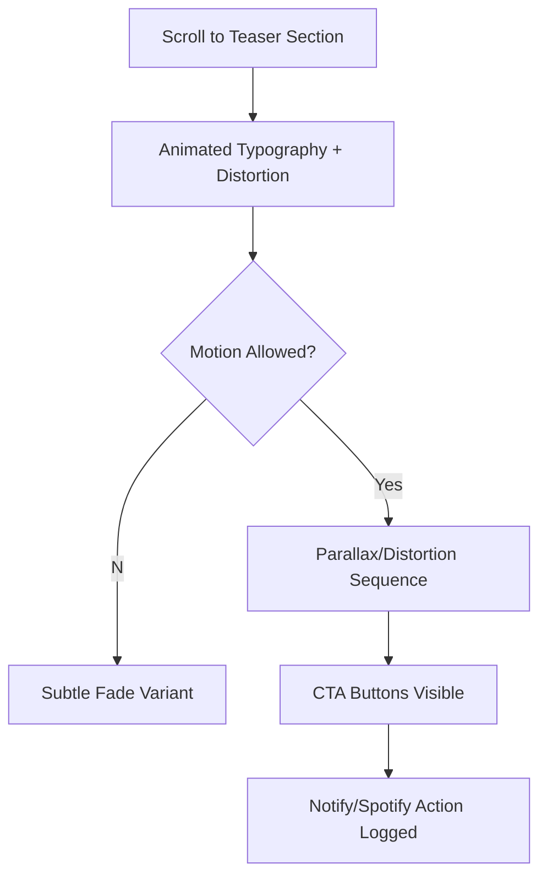

# Project Web NMD UI/UX Specification

## Introduction
This document defines the user experience goals, information architecture, user flows, and visual design specifications for Project Web NMD's user interface. It serves as the foundation for visual design and frontend development, ensuring a cohesive and user-centered experience.

### Overall UX Goals & Principles

**Target User Personas**  
- **Fans & Culture Enthusiasts:** Ages 18–34, digitally native music lovers who crave cinematic storytelling, quick audio access, and a deeper emotional bond with each member; they arrive from social posts or playlists and need a single immersive destination.  
- **Collaborators & Industry Scouts:** Creative directors, booking agents, brand partners, and label teams who need polished, high-performance presentations plus concise bios, proof of craft, and frictionless collaboration paths to evaluate the collective quickly.  
- **Collective & Creative Directors (Internal Stakeholders):** Core NMD members, visual leads, and motion designers who must keep the experience on-brand, reuse assets efficiently, and trigger hype for upcoming releases like “Midnight Is Close” without relying on engineers for every update.

**Usability Goals**  
1. **Immediate immersion:** Users should enter the “living music video” within 3 seconds, with loader-to-hero transitions free of stutter.  
2. **Intuitive exploration:** Fans and scouts can reach artist profiles or music previews in ≤2 interactions from the hero section.  
3. **Accessible motion:** Cinematic effects adapt automatically for reduced-motion preferences while preserving narrative clarity.  
4. **Conversion clarity:** Collaboration CTAs and Spotify links remain visible throughout the scroll journey, with success feedback in under 1 second.  
5. **Mobile parity:** The entire experience (including horizontal galleries) remains delightful and usable on touch devices with 44px+ targets.

**Design Principles**  
1. **Cinematic Storytelling First** – Treat each section like a film scene: establish mood, reveal content deliberately, and choreograph motion/audio as one narrative.  
2. **Guided Exploration** – Always provide subtle markers, scroll cues, and overlays so visitors never wonder “where to go next.”  
3. **Tactile Motion, Responsible Performance** – Pair GSAP/Three.js flourishes with pragmatic fallbacks, ensuring 60fps where possible and graceful degradations where not.  
4. **Audio-Visual Consent & Control** – Give users clear agency over sound/autoplay, honoring accessibility and cultural expectations.  
5. **Data-Informed Clarity** – Every interaction should reinforce KPIs (Spotify, inquiries); instrument pathways so we can refine based on actual behavior.

### Change Log

| Date | Version | Description | Author |
| 2024-06-03 | v0.1 | Initial UX spec draft (personas, IA, flows foundations) | Sally |

## Information Architecture (IA)

### Site Map / Screen Inventory
```mermaid
graph TD
    A[Entry Loader] --> B[Hero + Navigation Markers]
    B --> C[Artists Gallery]
    C --> C1[Artist Profile Overlay]
    B --> D[Music Projects]
    D --> D1[Tracklists]
    D --> D2[Audio Preview Controls]
    B --> E[Upcoming Release Teaser]
    B --> F[Collaboration CTA]
    F --> F1[Contact Modal/Section]
    E --> G["Notify Me" / Spotify CTA]
    B --> H[Global Footer (Social Links)]
    B --> I[Merch Shop]
    I --> I1[Product Detail Overlay]
    I --> I2[Cart Drawer / Checkout Handoff]
```

### Navigation Structure
**Primary Navigation:** Minimal anchor-based nav surfaced as floating markers (Artists -> Music -> Merch -> Release -> Contact) plus persistent CTA button (“Listen / Spotify”). On desktop, markers sit along the right edge; on mobile they collapse into a pill that expands on tap.

**Secondary Navigation:** Within sections, horizontal gallery scrubber dots, artist overlay tabs (Bio · Projects · Socials), and inline “Next Section” chevrons guiding continuous scroll.

**Breadcrumb Strategy:** Not applicable (single-page cinematic narrative). Instead, use subtle section labels pinned on scroll to orient users.

## User Flows

### Cinematic Entry Flow
**User Goal:** Experience the collective’s world instantly and understand navigation cues.

**Entry Points:** Direct link to root URL, campaign links to hero anchor.

**Success Criteria:** Loader completes under 3s, hero mask animation plays smoothly, nav markers become visible, user scrolls or taps to next section.

#### Flow Diagram


#### Edge Cases & Error Handling:
- Loader exceeds 3s → show progress indicator + copy (“Entering NMD’s world…”).
- WebGL unsupported → serve SVG animation fallback.
- Reduced-motion enabled → skip mask animation, fade in hero and show textual prompt.

**Notes:** Log loader duration and hero-scroll completion for KPI tracking.

### Artist Exploration Flow
**User Goal:** Discover individual members, read bios, and branch to socials/projects quickly.

**Entry Points:** Hero nav marker “Artists,” inline CTA, deep link `/#artists`.

**Success Criteria:** User scrolls/drag to desired portrait, opens overlay, and interacts with at least one link or CTA.

#### Flow Diagram
```mermaid
graph TD
    A[Hero Marker: Artists] --> B[Horizontal Gallery]
    B --> C[Scroll/Drag Through Cards]
    C --> D[Select Artist Card]
    D --> E[Overlay Opens (Bio/Socials/Projects)]
    E --> F{Desired Action?}
    F --Visit Social--> G[External Link / New Tab]
    F --Contact CTA--> H[Contact Modal Pre-filtered]
    F --Close--> I[Return to Gallery]
```

#### Edge Cases & Error Handling:
- Portrait fails to load → show gradient placeholder with initials.
- Overlay content missing fields → hide section and surface “Coming soon.”
- Keyboard navigation: arrow keys shift focus; ESC closes overlay.

**Notes:** Provide micro-interactions (parallax, particle shimmer) but pause them when overlay is open.

### Music Sampling Flow
**User Goal:** Preview album tracks (starting with “Junta”) and jump to Spotify with confidence.

**Entry Points:** Hero marker “Music,” inline CTA from artist overlays, deep link `/#music`.

**Success Criteria:** User expands album card, plays snippet, and/or taps Spotify CTA.

#### Flow Diagram


#### Edge Cases & Error Handling:
- Browser blocks autoplay → show inline “Enable audio” toast.
- Multiple previews triggered → auto-stop previous track and highlight active one.
- Mobile data saver detected → default to silent mode with explicit play control.

**Notes:** Track preview analytics should include track ID, duration listened, device type.

### Collaboration & Inquiry Flow
**User Goal:** Submit a collaboration or booking request without leaving the site.

**Entry Points:** Persistent “Collaborate” CTA, artist overlay buttons, teaser section CTA, footer contact links.

**Success Criteria:** User opens contact form, fills mandatory fields, and sees success confirmation or alternative email.

#### Flow Diagram


#### Edge Cases & Error Handling:
- Network failure → show retry button + fallback mailto link.
- Spam detection triggered → ask user to complete lightweight captcha.
- Mobile keyboard overlap → auto-scroll form fields into view.

**Notes:** Pre-fill artist name when launched from overlay; log drop-off points (open, type, submit).

### Upcoming Release Teaser Flow
**User Goal:** Feel hype for “Midnight Is Close” and optionally opt into updates or jump to teaser content.

**Entry Points:** Scroll past music section; direct `/#release` deep link.

**Success Criteria:** Teaser animation plays or fades (per motion settings) and user interacts with “Notify me” or Spotify CTA.

#### Flow Diagram


#### Edge Cases & Error Handling:
- Reduced-motion or high-contrast mode → swap to simplified styles.
- CTA disabled (info not ready) → show “Coming soon” chip with tooltip.
- Long idle time → loop animation slowly but pause audio cues.

**Notes:** Consider optional countdown timer; ensure text contrast stays AA+ even with distortion.

### Merch Browsing & Checkout Flow
**User Goal:** Explore merch drops, inspect details, and purchase without leaving the cinematic journey.

**Entry Points:** Hero merch teaser, dedicated Merch navigation marker, or inline calls-to-action within artist overlays.

**Success Criteria:** User views at least one product detail, adds to cart, and reaches provider-hosted checkout (or completes purchase) with minimal friction.

#### Flow Diagram
`mermaid
graph TD
    M0[Merch Teaser CTA] --> M1[Merch Section Scroll]
    M1 --> M2[Select Product]
    M2 --> M3[Product Detail Overlay]
    M3 --> M4[Add to Cart]
    M4 --> M5[Cart Drawer Review]
    M5 --> M6{Checkout Path}
    M6 -- Hosted Checkout --> M7[Commerce Provider]
    M6 -- Save for Later --> M8[Close Drawer / Continue Browsing]
`

#### Edge Cases & Error Handling
- Inventory sold out -> show "Out of stock" badge and disable CTA.
- Checkout failure from provider -> display toast with retry + support link.
- User closes overlay with active cart -> persist cart badge state and analytics event.

**Notes:** Cart badge should surface in primary nav; track merch funnel events (view -> add -> checkout) and coordinate styling with performance budgets.

## Wireframes & Mockups

**Primary Design Files:** Figma – Project Web NMD / UX Concepts (to be shared via `/figma/project-web-nmd`).

### Loader + Hero Composite
**Purpose:** Establish the cinematic identity, transition users from loading to hero, and expose navigation cues.

**Key Elements:**
- Three.js canvas with spinning 3D logo, light streaks, and progress indicator.
- Hero portrait with GTA VI–style mask reveal overlaid copy (“ENTER THE WORLD OF NMD”).
- Floating nav markers + “Listen on Spotify” CTA.

**Interaction Notes:** Loader eases to hero using GSAP timeline; nav markers fade/slide in after transition; hero responds to cursor tilt within ±6°.

**Design File Reference:** Figma Frame `Loader-Hero_v01`.

### Artist Gallery Screen
**Purpose:** Showcase all 12 members with tactile horizontal exploration.

**Key Elements:**
- Horizontal card rail with variable sizes to create depth.
- Particle layer + parallax background gradient.
- Selected card expands into overlay with Bio/Socials/Projects tabs.

**Interaction Notes:** Drag velocity determines inertial scroll; overlay traps focus; particle intensity throttles on scroll end.

**Design File Reference:** Figma Frame `Artists-Gallery_v02`.

### Music Projects Screen
**Purpose:** Highlight “Junta” and upcoming releases with tracklists and previews.

**Key Elements:**
- Album cards with artwork, metadata pill, short description.
- Expandable tracklist with play controls.
- Dual CTA row (“Listen on Spotify”, “View Story”).

**Interaction Notes:** Preview button animates waveform ring; entire card subtly pulses with beat-synced glow when audio is active.

**Design File Reference:** Figma Frame `Music-Grid_v01`.

### Release Teaser Screen
**Purpose:** Build anticipation for “Midnight Is Close” with bold typography and motion.

**Key Elements:**
- Oversized wordmark with distortion shader.
- Sub-headline describing drop window.
- Two CTAs (“Notify me”, “Preview mood”).

**Interaction Notes:** Typography wavers with GSAP noise function; CTA hover triggers chromatic aberration effect; reduced-motion uses static blur gradient.

**Design File Reference:** Figma Frame `Teaser_v01`.

### Contact Modal / Section
**Purpose:** Provide frictionless collaboration inquiries and signal professionalism.

**Key Elements:**
- Modal with segmented controls for inquiry type.
- Form fields (name, org, email, message, desired artist).
- Social proof chips (“Worked with …”) near submit button.

**Interaction Notes:** Modal launches with scale+blur; submission success swaps to confetti shimmer; failure states shake field group lightly.

**Design File Reference:** Figma Frame `Contact-Modal_v01`.

## Component Library / Design System

**Design System Approach:** Extend Shadcn UI with a custom “NMD Neon” theme: shared tokens for colors, typography, and motion utilities; document components alongside React implementation notes to keep dev/design parity.

### Core Components

#### Section Marker
**Purpose:** Provide persistent navigation anchors for each scroll scene.

**Variants:** Text-only chip, icon+label, compact mobile pill.

**States:** Idle, hover/focus (glow), active (filled).

**Usage Guidelines:** Place within viewport edges; always pair with aria-live updates when section changes.

#### Artist Card
**Purpose:** Display member portrait and teaser copy within horizontal gallery.

**Variants:** Default, featured (larger), upcoming (desaturated).

**States:** Rest, hover/tilt, selected (expands), disabled (placeholder).

**Usage Guidelines:** Maintain 16:9 ratio; overlay gradient ensures text legibility; support keyboard focus ring.

#### Audio Preview Control
**Purpose:** Trigger 5–10 second snippets with visual feedback.

**Variants:** Icon button, list inline control.

**States:** Idle, hover/focus, playing (progress ring), error (tooltip).

**Usage Guidelines:** One active preview at a time; always show mute/stop icon; announce playback status to screen readers.

#### CTA Button (Primary)
**Purpose:** Drive conversions (Spotify, Notify, Collaborate).

**Variants:** Filled neon, outline, ghost.

**States:** Default, hover, active/pressed, disabled, loading.

**Usage Guidelines:** Maintain 48px min height; pair with icon when linking externally; add trailing arrow for scroll actions.

#### Merch Product Card
**Purpose:** Showcase apparel/collectible items with imagery, price, and quick add-to-cart.

**Variants:** Feature (large hero tile), standard grid card, low-inventory (badge).

**States:** Idle, hover (parallax zoom), selected (open detail overlay), sold out (disabled).

**Usage Guidelines:** Reuse media optimization pipeline outputs; ensure price and size availability are readable over hover effects; include `aria-describedby` for accessibility.

#### Cart Drawer
**Purpose:** Provide persistent summary of selected items and entry point to checkout.

**Variants:** Desktop drawer (right-side), mobile full-height sheet.

**States:** Closed, open (with focus trap), loading (when syncing), error toast.

**Usage Guidelines:** Trigger from nav icon; maintain keyboard focus within drawer; show subtotal, taxes/fees estimate, and checkout CTA that launches provider-hosted flow.

## Branding & Style Guide

### Visual Identity
**Brand Guidelines:** Internal moodboards + GTA VI / Utopia references (see `/brand/nmd-style.pdf`). Use neon-on-carbon palette, cinematic noise textures, and bold sans-serif typography.

### Color Palette
| Color Type | Hex Code | Usage |
|------------|----------|-------|
| Primary | #EB2C75 | Hero accents, primary CTAs, loader glow |
| Secondary | #1E6DF8 | Navigation markers, hover states |
| Accent | #F5C84C | Highlights, particles, progress rings |
| Success | #4BE5B5 | Form confirmations, status chips |
| Warning | #FFB347 | Audio permission prompts, gentle alerts |
| Error | #FF5C74 | Form validation, failure to load |
| Neutral | #05060E / #F5F6FB | Backgrounds, text, dividers |

### Typography

#### Font Families
- **Primary:** Space Grotesk (700/500 for headings)
- **Secondary:** Sora (400/500 for body and supporting labels)
- **Monospace:** IBM Plex Mono (metrics, timer readouts)

#### Type Scale
| Element | Size | Weight | Line Height |
|---------|------|--------|-------------|
| H1 | 72px | 700 | 1.05 |
| H2 | 48px | 700 | 1.1 |
| H3 | 32px | 600 | 1.2 |
| Body | 18px | 400 | 1.5 |
| Small | 14px | 500 | 1.4 |

### Iconography
**Icon Library:** Lucide + custom neon-outline set for music controls.  
**Usage Guidelines:** Keep stroke at 1.5px, align with text baseline, use accent glow on hover; ensure descriptive `aria-label`s for actionable icons.

### Spacing & Layout
**Grid System:** Fluid 12-column grid (80px gutters desktop, 24px mobile) with 1440px design reference.  
**Spacing Scale:** 8pt base scale (4-8-16-24-32-48-64-96) with “hero” spacers at 160px for cinematic breathing room.

## Accessibility Requirements

**Standard:** WCAG 2.1 AA (aim for AAA contrast on core copy).

### Key Requirements
**Visual:**
- Color contrast ratios: ≥4.5:1 for text; neon accents require dark backing plates.
- Focus indicators: 3px outer glow + 2px inner stroke for clarity on dark backgrounds.
- Text sizing: Body 18px minimum; allow user scaling up to 200% without layout break.

**Interaction:**
- Keyboard navigation: Support tab order through nav markers, gallery cards, overlays, forms; provide skip-to-content link.
- Screen reader support: Announce section titles as they enter viewport; describe animations succinctly.
- Touch targets: Minimum 44x44px; keep horizontal gallery handles reachable with thumb zones.
- Cart drawer: Trap focus while open, announce item count updates, and expose checkout CTA as a proper button element.

**Content:**
- Alternative text: Detailed descriptions for hero portrait, album art, artist imagery.
- Heading structure: H1 for hero, sequential H2/H3 for sections to aid assistive tech.
- Form labels: Persistent labels + helper text; error messaging ties to inputs via `aria-describedby`.
- Pricing & merch: Include currency in accessible text (`aria-label`, visually), and mark limited inventory badges with textual equivalents.

### Testing Strategy
Manual audits with VoiceOver/NVDA, axe DevTools, and Playwright accessibility scans per milestone. Include reduced-motion and high-contrast simulations in regression checklist.

## Responsiveness Strategy

### Breakpoints
| Breakpoint | Min Width | Max Width | Target Devices |
|------------|-----------|-----------|----------------|
| Mobile | 0px | 639px | Phones (portrait/landscape) |
| Tablet | 640px | 1023px | Small tablets, foldables |
| Desktop | 1024px | 1439px | Laptops, standard monitors |
| Wide | 1440px | - | Large monitors, cinematic displays |

### Adaptation Patterns
**Layout Changes:** Stack sections vertically on mobile with condensed paddings; convert horizontal gallery to swipeable carousel; maintain 16:9 hero but crop with focus area; merch grid drops to 2-column cards with horizontal scroll overflow.  
**Navigation Changes:** Floating nav markers collapse into a single “Menu” pill on mobile; contact CTA docks at bottom-right as FAB.  
**Content Priority:** Surface CTA + key stats higher on mobile; defer secondary copy into accordions; keep audio previews optional to save data; highlight featured merch tile ahead of full catalog.  
**Interaction Changes:** Replace hover cues with tap states; provide swipe hints for galleries; reduce motion intensity by ~40% on tablet/mobile to conserve battery; add cart drawer swipe-down gesture on mobile.

## Animation & Micro-interactions

### Motion Principles
- **Cinematic sequencing:** Trigger animations sequentially to mimic film cuts rather than simultaneous chaos.
- **Physics-lite:** Use easing curves with slight overshoot (`back.out(1.4)`) for tactile feel.
- **Respectful motion:** Always check `prefers-reduced-motion`; offer manual replay controls for key sequences.

### Key Animations
- **Loader Orbit:** Three.js logo rotation with light streaks (Duration: 2.8s loop, Easing: linear-in-out).
- **Hero Mask Reveal:** GSAP scroll-linked SVG mask (Duration: tied to 600px scroll, Easing: power3.out).
- **Gallery Parallax:** Depth layers shift at 0.3–0.6x scroll speed (Duration: continuous, Easing: none/linear).
- **Audio Preview Pulse:** Circular progress ring + waveform glow (Duration: snippet length, Easing: easeInOutSine).
- **Teaser Distortion:** Noise-based warp on typography (Duration: 6s loop, Easing: custom noise function).

## Performance Considerations

### Performance Goals
- **Page Load:** <3s to interactive on broadband; <5s on 3G fallback with lightweight assets.
- **Interaction Response:** <100ms for button taps and gallery navigation.
- **Animation FPS:** 60fps target desktop, ≥45fps on mid-tier mobile; degrade gracefully otherwise.

### Design Strategies
Leverage Next.js image optimization and video-atlas sprites for particles; lazy-load Three.js scenes after initial contentful paint; provide low-res placeholders for hero/gallery; throttle motion intensity when `requestAnimationFrame` drops below threshold; reuse GSAP timelines where possible to avoid re-instantiating animations per section.

## Next Steps

### Immediate Actions
1. Review this spec with the creative directors + dev lead to confirm motion priorities.
2. Flesh out detailed Figma frames (desktop + mobile) for each key section, including reduced-motion variants.
3. Build rapid prototypes for loader, gallery, and teaser to validate feasibility/performance.
4. Align with architect/front-end lead on component inventory and Shadcn theming tokens.

### Design Handoff Checklist
- [ ] All user flows documented
- [ ] Component inventory complete
- [ ] Accessibility requirements defined
- [ ] Responsive strategy clear
- [ ] Brand guidelines incorporated
- [ ] Performance goals established

## Checklist Results
UI/UX checklist pending (run after stakeholder review of full spec).


